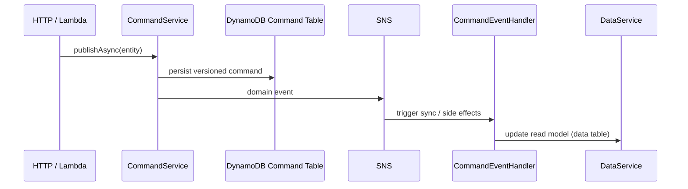

# @mbc-cqrs-serverless/core

Foundation package: CQRS write/read path, DynamoDB persistence, SNS/SQS messaging, notifications, Step Functions helpers, and NestJS host bootstrap.

## Depends on

None (base package). All other feature packages depend on `core`.

## Used by

See [package-graph.md](../package-graph.md). Every `@mbc-cqrs-serverless/*` feature package imports `core` modules or services.

## Public API (summary)

Main export surface: `packages/core/src/index.ts` — `CommandModule`, `CommandService`, `DataService`, `DataStoreModule`, `QueueModule`, `AppModule`, context helpers, guards, decorators.

Full export list: [_generated/module-service-index.md](../_generated/module-service-index.md).

## Submodule docs

- [modules.md](./modules.md) — NestJS modules and registration
- [services.md](./services.md) — injectable services and write/read path

## Typical command flow



## How to change safely

```bash
npm test --workspace=@mbc-cqrs-serverless/core
```

- Integration behavior: `packages/core/src/integration/*.spec.ts`
- Command/event changes: update `command.event.handler.ts` tests and any data-sync handlers
- After adding modules/services: `npm run docs:agents:gen`

## Related

- [services.md](./services.md)
- [modules.md](./modules.md)
- [docs/architecture/cqrs-flow.md](../../architecture/cqrs-flow.md)
- npm README: [packages/core/README.md](../../../packages/core/README.md)
