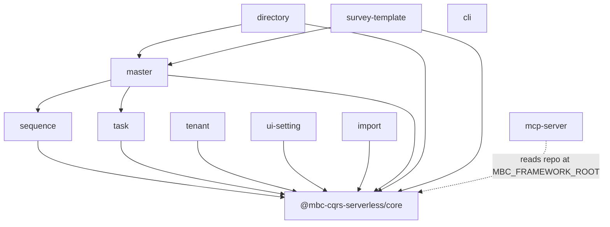

# Package dependency graph

> **Used by** column is derived from `package.json` dependencies. Regenerate with `npm run docs:agents:gen` and refresh this table if package coupling changes.

## Diagram

`cli` scaffolds consumer applications; it does not import feature packages at runtime.

## Package table

| Package | Purpose | Depends on | Used by |
|---------|---------|------------|---------|
| `core` | CQRS command/query, AWS integrations, app bootstrap | — | sequence, task, tenant, ui-setting, import, master, directory, survey-template |
| `sequence` | Time-rotating ID sequences | core | master |
| `task` | Long-running / Step Functions tasks | core | master |
| `tenant` | Multi-tenant CRUD and context | core | — |
| `ui-setting` | UI configuration entities | core | — |
| `import` | CSV / batch import pipelines | core | — |
| `master` | Master data and hierarchical settings | core, sequence, task | directory, survey-template |
| `directory` | Directory and file metadata | core, master | — |
| `survey-template` | Survey templates and answers | core, master | — |
| `cli` | Project scaffolding (`mbc new`, generate) | — | — |
| `mcp-server` | MCP resources/tools for AI clients | — | — (reads monorepo root) |

## Where to start changing code

| Change type | Start in |
|-------------|----------|
| Write path, DynamoDB command table, SNS publish | `core` → [core/services.md](./core/services.md) |
| New published npm feature module | New or existing package under `packages/`; depend on `core` only unless you need master/task |
| Async job / SFN orchestration | `task` + host app Step Functions |
| Master data / settings hierarchy | `master` |
| Agent/MCP documentation exposure | `mcp-server` + `docs/agents/` |
