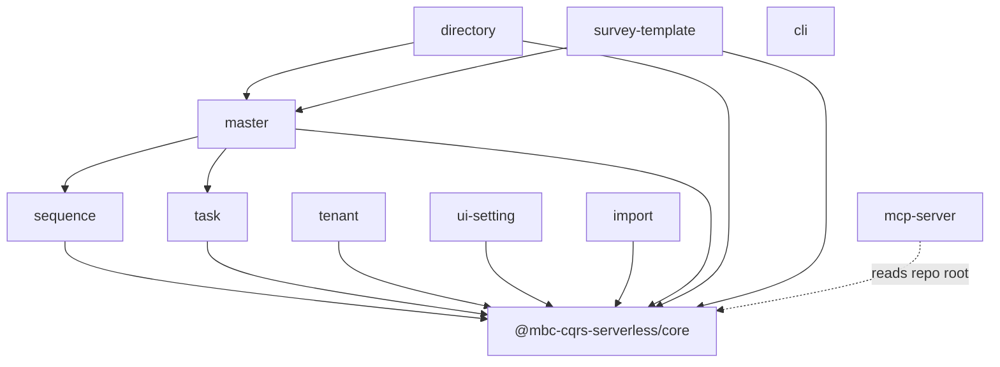

# Contributor Agent Framework Reference — Design Spec

**Date:** 2026-05-21  
**Status:** Approved (brainstorming)  
**Audience:** Contributors and AI agents maintaining the `mbc-cqrs-serverless` monorepo  
**Goal:** Document all packages, NestJS modules, key services, dependencies, and how to use them — so agents and maintainers do not guess boundaries or miss global registration patterns.

---

## 1. Problem Statement

The monorepo has:

- `AGENTS.md`, `llms.txt`, `llms-full.txt` — high-level context, not a full framework map
- Per-package `README.md` — consumer-oriented, not internal module/service graphs
- `docs/architecture/` — AWS/CQRS flows, not package-to-package relations
- `@mbc-cqrs-serverless/mcp-server` — serves `llms-full.txt` as overview; no structured agent reference tree

Contributors and coding agents lack a single, accurate reference for **what exists**, **how pieces connect**, and **how to change safely**.

---

## 2. Requirements

### Must have

1. **Package catalog** — all published workspace packages with purpose, npm name, and inter-package dependencies (from `package.json`).
2. **Per-package reference** — modules, services, controllers, event handlers, registration patterns (`register()`, `forRoot()`, global modules).
3. **Relationship maps** — package dependency graph; for `core`, module import/provider graph.
4. **Usage guidance** — when to use which service/module; typical flows; pitfalls (e.g. `TaskModule.register()` is global once).
5. **Agent entry point** — `docs/agents/README.md` linked from root `AGENTS.md`.
6. **Generated inventory** — CI-verified index of modules/services/exports to reduce drift.
7. **MCP integration** — new resources under `mbc://docs/agents/*` reading from `docs/agents/`.

### Should have

- Thin `llms-full.txt` index pointing to `docs/agents/` (not duplicating full content).
- `CONTRIBUTING.md` link to agent reference for maintainers.
- Example “deep” package doc: `core` completed first as template for others.

### Out of scope (v1)

- Public Docusaurus site publish (follow-up).
- Consumer-app agent guides (audience B only: monorepo contributors).
- Auto-generated narrative prose (only structured inventory is generated).

---

## 3. Information Architecture

```
docs/agents/
├── README.md                      # Entry: reading order, conventions, links
├── package-graph.md               # Mermaid + table: all packages & deps
├── conventions.md                 # Naming, register patterns, testing expectations
├── core/
│   ├── overview.md
│   ├── modules.md                 # AppModule, CommandModule, DataStoreModule, ...
│   └── services.md                # CommandService, DataService, ...
├── sequence/
│   └── overview.md
├── task/
│   └── overview.md
├── master/
│   └── overview.md
├── tenant/
│   └── overview.md
├── import/
│   └── overview.md
├── directory/
│   └── overview.md
├── ui-setting/
│   └── overview.md
├── survey-template/
│   └── overview.md
├── cli/
│   └── overview.md
├── mcp-server/
│   └── overview.md
└── _generated/                    # DO NOT EDIT — CI output
    ├── inventory.json
    └── module-service-index.md
```

### Per-package document template

Each `overview.md` (and `core/modules.md` / `core/services.md` where split) includes:

| Section | Content |
|---------|---------|
| Purpose | One paragraph: problem this package solves |
| Public API | Main `index.ts` exports |
| Modules | NestJS modules, `register()` options, global flag |
| Services | Injectable classes, responsibility, key methods |
| Event handlers | `@EventHandler` classes if any |
| Depends on | `@mbc-cqrs-serverless/*` + AWS services |
| Used by | Reverse edges from generated graph |
| Typical flows | Sequence diagram or bullet flow |
| How to change safely | Tests, packages to run, common mistakes |
| Related | README, architecture docs, examples |

---

## 4. Package Dependency Graph (baseline)



`cli` scaffolds apps that depend on `core`; it does not import other feature packages at runtime.

---

## 5. Core Package — Reference Model (Section 2 detail)

`core` is the foundation; other packages import its modules/services.

### 5.1 Top-level composition (`AppModule.forRoot`)

| Imported module | Role |
|-----------------|------|
| `NotificationModule` | Email, AppSync notifications |
| `DataStoreModule` | Global DynamoDB, S3, session |
| `DataSyncModule` | Command-event → data sync handlers |
| `StepFunctionModule` | SFN client, resume/start |
| `QueueModule` | SNS/SQS factories and services |
| `EventModule` | Event route (`/event`) when `EVENT_SOURCE_DISABLED !== 'true'` |
| Host `rootModule` | Application feature modules under `/api` |

### 5.2 Feature modules in `core`

| Module | Key providers / exports | Notes |
|--------|-------------------------|-------|
| `CommandModule` | `CommandService`, `DataService`, `HistoryService`, `Repository`, `TtlService`, `CommandEventHandler` | Per-table `register({ tableName, dataSyncHandlers })` |
| `DataStoreModule` | `DynamoDbService`, `S3Service`, `SessionService` | `@Global()` |
| `QueueModule` | `SnsService`, `SqsService`, client factories | Used by events/tasks |
| `DataSyncModule` | Data sync event wiring | Works with command events |
| `EventModule` | `EventBus`, event services | HTTP event ingestion |
| `NotificationModule` | `EmailService`, `AppSyncService`, `AppSyncEventsService` | Optional transports |
| `StepFunctionModule` | `StepFunctionService` | Task resume patterns |

### 5.3 Critical services (write/read path)

```
HTTP Command → CommandService.publishAsync / publishSync
              → DynamoDB command table + SNS
              → CommandEventHandler / Step Functions
              → DataService (read model) / HistoryService

HTTP Query   → DataService.getItem / query
              → DynamoDB data table (via DynamoDbService)
```

### 5.4 Downstream usage pattern

Feature packages (e.g. `master`) typically:

1. Import `DataStoreModule`, `QueueModule`
2. Register `CommandModule.register({ tableName })` inside their `register()`
3. Optionally import `SequencesModule`, `TaskModule`, custom handlers

Document this pattern in `master/overview.md` as the canonical “feature package” example after `core` is complete.

---

## 6. Generator & CI (Section 3)

### Script: `scripts/generate-agent-inventory.ts`

**Inputs:** `packages/*/package.json`, `packages/*/src/**/*.module.ts`, `packages/*/src/**/*.service.ts`, `packages/*/src/index.ts`

**Outputs:**

- `docs/agents/_generated/inventory.json` — structured: packages, dependencies, modules, services, exports
- `docs/agents/_generated/module-service-index.md` — markdown table for agents

**CI:** `npm run docs:agents:check` fails if generated files differ from repo (same pattern as format check).

**PR rule:** Hand-edited narrative under `docs/agents/**` (excluding `_generated/`); run `npm run docs:agents:gen` when adding modules/services.

---

## 7. Integration with Existing Artifacts (Section 4)

| Artifact | Change |
|----------|--------|
| `AGENTS.md` | Add “Start here: `docs/agents/README.md`” at top |
| `llms-full.txt` | Replace body with short index + links to `docs/agents/` paths |
| `llms.txt` | Add link to `docs/agents/README.md` |
| `CONTRIBUTING.md` | Section “AI-assisted contribution” → agent docs |
| `packages/mcp-server` | Register `mbc://docs/agents/*` resources; overview reads README + package-graph |
| `.cursorrules` | Optional one-line pointer to `docs/agents/README.md` |

---

## 8. Testing & Quality

1. **Generator unit test** — smoke test on fixture package layout; output schema stable.
2. **Link check** — script or test verifies `docs/agents/**/*.md` internal links resolve.
3. **Manual review gate** — first PR: `core` docs reviewed by maintainer for accuracy.
4. **No placeholder TBD** in committed narrative docs.

---

## 9. Rollout Phases

| Phase | Deliverable |
|-------|-------------|
| P0 | Generator + `_generated/` + `package-graph.md` + `README.md` |
| P1 | `core/` full reference (template quality) |
| P2 | `master`, `task`, `sequence` (highest coupling) |
| P3 | Remaining packages + MCP resources |
| P4 | Thin `llms-full.txt` + CONTRIBUTING/AGENTS links |

---

## 10. Success Criteria

- A new contributor (or agent) can answer without reading source: “Which package owns task queues?” “What does `CommandModule.register` require?” “What imports `TaskModule`?”
- CI fails when module/service inventory drifts from code.
- MCP `mbc://docs/agents/package-graph` returns current dependency graph.

---

## 11. Open Decisions (resolved)

| Question | Decision |
|----------|----------|
| Audience | Contributors only (monorepo maintainers/agents) |
| Delivery | Hybrid: generated inventory + hand-written per-package docs |
| Single file vs tree | Tree under `docs/agents/`; thin `llms-full.txt` index |
| Doc site | Out of scope v1; structure allows later publish |
